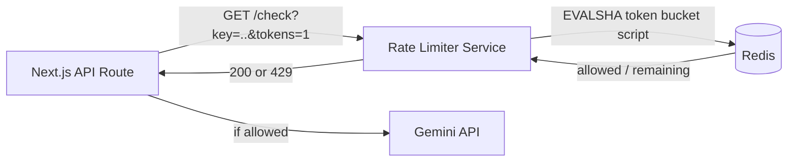

🔗 [Live demo](https://artigaund.github.io/rate-limiter/)


# rate-limiter

A standalone, Redis-backed rate limiter built in Java, used to protect the Gemini API usage in [StudySprout](https://www.studysprouts.in) from abuse — deployed independently and called over HTTP by the main app on every AI-generation request.

## Why this exists

StudySprout generates flashcards from user notes using the Gemini API. Every generation costs money and compute. Without a limiter, a single user (accidentally via a double-click, or deliberately via a script) could fire unlimited generation requests and rack up API costs with no ceiling. This service sits in front of that flow and answers one question on every request: **"has this user/resource exceeded their allowed rate?"**

## How it works — token bucket, atomic via Redis Lua script

Each rate-limit key (see [Key scoping](#key-scoping)) maps to a token bucket stored in Redis as a hash (`tokens`, `last_refill`). On every check:

1. Read current token count and last refill timestamp.
2. Refill tokens based on elapsed time × configured refill rate, capped at max capacity.
3. If enough tokens are available, consume them and allow the request. Otherwise, deny it.
4. Write the updated state back.

The critical detail: **all four steps run as a single Lua script via Redis `EVALSHA`**, so Redis executes them atomically and single-threaded. Two concurrent requests for the same key cannot race each other — one will always see the other's decrement, even under real concurrent load. This was verified directly (see [Testing](#testing--verification) below) by firing simultaneous requests at the same key and confirming exactly one was allowed.



## Configuration

| Env var | Default | Description |
|---|---|---|
| `PORT` | `8080` | HTTP port |
| `REDIS_URL` | *(required)* | Redis connection string (Redis Cloud in production) |
| `BUCKET_CAPACITY` | `20` | Max tokens per bucket — i.e. burst allowance before throttling kicks in |
| `BUCKET_REFILL_PER_SEC` | `0.5` | Tokens regenerated per second |

**Current production config:** `BUCKET_CAPACITY=1`, `BUCKET_REFILL_PER_SEC=0.0166667` (≈ 1 token per 60s), giving a strict "1 generation per 60 seconds" limit with zero burst allowance.

## API

### `GET /check?key={key}&tokens={n}`
Attempts to consume `n` tokens (default 1) from the bucket for `key`. Returns:
```json
{"allowed": true, "remaining": 0.00}
```
`200` if allowed, `429` if not.

### `GET /health`
```json
{"status": "ok"}
```

## Key scoping

Keys are constructed as `{userId}:{resourceId}` by the calling app, so the limit applies **per user, per resource** — a user generating flashcards for File A doesn't get throttled out of generating for File B seconds later, but repeatedly regenerating the *same* resource is blocked. This was a deliberate fix after initial testing showed a flat `userId`-only key throttled legitimate multi-file workflows.

## Testing & verification

This service went through iterative testing directly against the deployed instance to verify correctness beyond "it compiles":

1. **Atomicity under true concurrency** — fired two simultaneous requests at the same key via `curl ... & curl ... & wait`, confirmed exactly one `allowed:true` and one `allowed:false`, with no possibility of a race given the atomic Lua script.
2. **Refill timing correctness** — scripted requests at 2s, 5s, 15s, 30s, and 60s gaps against the same key to find the exact point the bucket permits a second request, confirming the configured refill rate produces the intended cooldown window (blocked through 30s, allowed at 60s).
3. **Fail-open behavior under cold start** — identified that Render's free-tier cold starts could exceed the calling app's fetch timeout, causing the check to fail and the request to be allowed by design (fail-open) — an explicit, documented tradeoff rather than a silent gap.
4. **Full integration test** — verified through the actual application route (not just the standalone service) that a 429 correctly propagates back to the caller and blocks the downstream Gemini call.

```bash
# Example: verifying the refill window
for gap in 2 5 15 30 60; do
  curl -s "$URL?key=test_$gap&tokens=1"
  sleep "$gap"
  curl -s "$URL?key=test_$gap&tokens=1"
done
```

## Tech stack

- Java 21, `com.sun.net.httpserver` (no framework overhead for a single-purpose service)
- Jedis 5.1 (Redis client) + Redis Cloud
- Maven, multi-stage Docker build, deployed on Render

## Lessons learned

- A rate limiter's correctness isn't just "does it block requests" — it's whether the *refill window* is longer than the operation it's protecting. A window that refills faster than the protected operation takes to run provides no real protection, even with perfectly atomic logic.
- Key scoping is a product decision, not just a technical one — the "right" key shape depends on what usage pattern you're actually trying to prevent versus what you're accidentally throttling.
- Fail-open vs. fail-closed on limiter downtime is a decision worth making explicitly, not by accident of a try/catch block.